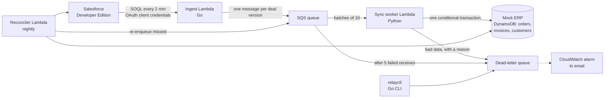

# Relay

[](https://github.com/ShathyaPranav/salesforce-erp-sync/actions/workflows/ci.yml)

Relay copies every Closed Won deal in Salesforce into an ERP as an order and
an invoice. It stays correct when messages arrive twice, arrive out of order,
or arrive while the ERP is down.

Delivery is at-least-once and every ERP write is idempotent and checked
against a version, so each valid deal ends up as at most one order and one
invoice, matching the latest version in Salesforce. Invalid deals go to a
dead-letter queue with a reason, and a nightly reconciler catches anything
the pipeline missed.

It runs serverless on AWS inside the free tier. The ingestion poller and the
ops CLI are in Go, the sync logic is in Python, every Lambda ships as a Docker
image, and GitHub Actions deploys it through OIDC. There's no frontend.

## Architecture



| Piece | Where | What to read first |
| --- | --- | --- |
| Poller | [`ingest/poller/poller.go`](ingest/poller/poller.go) | `Run`: the half-open watermark window |
| Salesforce client | [`internal/salesforce/client.go`](internal/salesforce/client.go) | token caching, 401 refresh, `nextRecordsUrl` paging |
| Event format | [`internal/events/event.go`](internal/events/event.go), [`docs/event-schema.md`](docs/event-schema.md) | the event key and version |
| Idempotent write | [`erp/writer.py`](erp/writer.py) | `write_order` and `_classify` |
| Worker | [`worker/app.py`](worker/app.py) | `handle_record`: success, retry or dead-letter |
| Error classification | [`worker/classify.py`](worker/classify.py), [`worker/backoff.py`](worker/backoff.py) | transient vs permanent, backoff |
| Reconciler | [`reconciler/reconcile.py`](reconciler/reconcile.py) | `compare` |
| Operations CLI | [`relayctl/main.go`](relayctl/main.go), [`relayctl/ops/dlq.go`](relayctl/ops/dlq.go) | `Redrive` |
| Infrastructure | [`template.yaml`](template.yaml), [`infra/bootstrap.yaml`](infra/bootstrap.yaml) | the queue, worker trigger and alarms |

The full design and its reasoning are in [`docs/PLAN.md`](docs/PLAN.md). The
build log, written for learning the system, is [`docs/LEARNING.md`](docs/LEARNING.md).

## Verified on AWS (25 Sep 2026)

The deployed stack (`relay-dev`, us-east-1), against a real Salesforce
Developer Edition org:

| What was run | Result |
| --- | --- |
| First poll of the org | 23 Closed Won deals published; 21 became orders and invoices within about 2 minutes; the 2 invalid deals (no Amount, no Account) were dead-lettered on their first attempt with `reason` = `missing_amount` / `missing_account` |
| Smoke test (`scripts/smoke.py`) | a unique synthetic deal went through the live queue and worker and was written, then cleaned up: PASS |
| Reconciler repair | an order deleted by hand was reported as `missing_order`, re-enqueued and restored; the 2 invalid deals were reported as `invalid_in_source`, not re-sent |
| 30% ERP chaos + full re-poll | all 23 deals re-published: 20 duplicates skipped, 10 transient retries with backoff of ~60 s then ~137 s, no double orders (still 21) |
| Alerting | `relay-dev-dlq-not-empty` went to ALARM |

CloudWatch metrics for that session: EventsPublished 46, OrdersWritten 23,
DuplicatesSkipped 20, TransientRetries 10, DeadLettered 4, DriftFound 3.

## Failure handling, and the test that proves each row

Every row is a failure triggered on purpose, in
[`tests/integration/test_failures.py`](tests/integration/test_failures.py),
through the real queue, the worker image and DynamoDB.

| Failure | What Relay does | Test |
| --- | --- | --- |
| Duplicate message | The conditional write sees the same version and does nothing | `test_1_duplicate_message_is_harmless` |
| ERP unavailable | Transient: visibility-timeout backoff (`base × 2^(n-1) + jitter`), then the DLQ after 5 receives; or it succeeds once the ERP recovers | `test_2a_…_backoff_then_dead_letters`, `test_2b_…_recovers_within_the_retry_budget` |
| Bad data (no Amount / Account) | Permanent: straight to the DLQ with a `reason`, never retried | `test_3_bad_data_goes_straight_to_the_dlq_with_a_reason` |
| Out-of-order updates | An older version fails the version check and is dropped as stale | `test_4_newer_version_delivered_first_survives` |
| Worker crashes mid-batch | The whole batch comes back; the records already written are no-ops | `test_5_crash_mid_batch_redelivers_the_batch_safely` |
| Write committed, ack lost | The redelivery hits the version check: a pure no-op | `test_6_write_succeeded_but_ack_lost_is_a_no_op` |
| Poller misses a record | The reconciler re-enqueues missing and out-of-date orders | `test_7_reconciler_repairs_missed_and_stale_orders` |
| Deal reverted or deleted | The reconciler reports it for a human, and changes nothing | `test_8_reverted_and_deleted_deals_are_reported_only` |

The poller's edge cases (equal timestamps, the lag zone, partial publish
failures, idle polls) are unit tests in
[`ingest/poller/poller_test.go`](ingest/poller/poller_test.go) and end-to-end
tests in [`tests/integration/test_ingest.py`](tests/integration/test_ingest.py).

## Run it locally (no AWS account needed)

You need Docker Desktop and Python 3.12. Go is optional: the compose `go`
service runs it in a container.

```powershell
docker compose up -d --build --wait     # LocalStack, fake Salesforce, the three Lambda images
python -m venv .venv; .venv\Scripts\pip install -r requirements-dev.txt
.venv\Scripts\python -m pytest          # unit, contract, integration and failure-injection tests
docker compose run --rm go go test ./...
```

The local stack runs LocalStack 4.14.0 for SQS, DynamoDB and SSM (pinned
because it's the last release that starts without an account token), a fake
Salesforce with the real OAuth and query response shapes plus an admin API
for injecting faults, and the three Lambda images under AWS's Runtime
Interface Emulator. A small test harness stands in for Lambda's SQS event
source mapping, which only exists on AWS.

## Two-minute demo (local)

With the stack up (`docker compose up -d --build --wait`):

```powershell
python scripts/local_bootstrap.py --reset-state        # watermark back to the start

# 1. One poll: six Closed Won deals published. Four become orders; the two
#    invalid ones are dead-lettered with a reason, never retried.
curl.exe -s -d "{}" http://127.0.0.1:9001/2015-03-31/functions/function/invocations
go run ./relayctl --local stats
go run ./relayctl --local dlq list

# 2. Poll again: nothing changed in Salesforce, so nothing is re-sent.
curl.exe -s -d "{}" http://127.0.0.1:9001/2015-03-31/functions/function/invocations

# 3. Every failure on purpose (~90 s). In a second terminal, watch the
#    retries back off and the dead-letters land:  docker compose logs -f worker
python -m pytest tests/integration/test_failures.py -v

# 4. Compare Salesforce with the ERP and repair any drift.
go run ./relayctl --local reconcile
```

Without a local Go install, replace `go run ./relayctl --local` with
`docker compose run --rm go go run ./relayctl --local --endpoint http://localstack:4566 --reconciler-url http://reconciler:8080/2015-03-31/functions/function/invocations`.

On AWS you can watch the same thing on the CloudWatch dashboard. Run
`go run ./relayctl --profile relay chaos --erp-fail-rate 0.3`, and
`TransientRetries` climbs while `OrdersWritten` keeps counting.

## Deploying

CI/CD is [`.github/workflows/ci.yml`](.github/workflows/ci.yml). Every push and
pull request runs the linters, the unit tests and the full failure-injection
suite on docker compose. A push to `main` then assumes a deploy role through
GitHub OIDC (no AWS keys are stored anywhere), runs `sam deploy`, and
smoke-tests the live stack with a unique synthetic deal.

The first deploy is done once from a laptop, following
[`docs/SETUP-CHECKLIST.md`](docs/SETUP-CHECKLIST.md):
1. `infra/bootstrap.yaml` creates the image repository and the OIDC deploy role.
2. `scripts/put_sf_secret.py` stores the Salesforce secret as an SSM SecureString.
3. `scripts/deploy.py` builds and deploys the stack.

A rollback is `git revert`, followed by the normal pipeline.

## Operating it

| Tool | For |
| --- | --- |
| `relayctl stats` | queue and DLQ depth, ERP counts, the watermark, chaos flags |
| `relayctl dlq list / redrive / ack` | triage dead-letters. `redrive` moves only transient failures back; fix bad data in Salesforce, then `ack` the old message |
| `relayctl reconcile [--dry-run]` | run the nightly comparison now |
| CloudWatch dashboard `relay-dev` | queue depth, the seven sync metrics, Lambda duration and errors, alarm state |
| Alarms (email) | DLQ not empty; oldest message over 20 min; ingest failing 3 times in 10 min |
| Logs Insights query `relay-dev/trace-one-deal` | every log line for one Opportunity, from poll to ERP write |

## Cost

Everything fits in the AWS free tier except ECR storage, which costs a few
cents a month. Nothing bills by the hour: there's no VPC, no NAT gateway and
no always-on compute.

- Lambda and SQS stay far below their free monthly requests. Even idle, the
  worker trigger's polling is a few hundred thousand SQS requests a month,
  against 1M free.
- DynamoDB is provisioned at 5/5 per table, 15 of the 25 always-free units.
- There are 7 custom metrics with one dimension each (10 are free) and 3
  alarms (10 are free).
- Logs are kept for 7 days.
- ECR costs about $0.10 per GB-month, and a lifecycle policy keeps only the
  newest 15 images.

Set a $1 AWS Budget that excludes credits as an early warning, and deploy
with `PollerState=DISABLED` to pause the poller between sessions.

## Known limits

- Salesforce timestamps have one-second precision, so two edits of one deal
  in the same second share a version. Because the poller stays 2 minutes
  behind, it always reads a second's final state, and the reconciler reports
  any mismatch left over.
- Metrics are approximate under retries: a redelivered message counts once
  as written and again as a duplicate.
- Reverted or deleted deals are reported, not undone, because reversing an
  issued invoice is a business decision.
- The sync is one-way. Sending ERP data back to Salesforce would need conflict
  resolution and loop prevention, which this project doesn't attempt.
