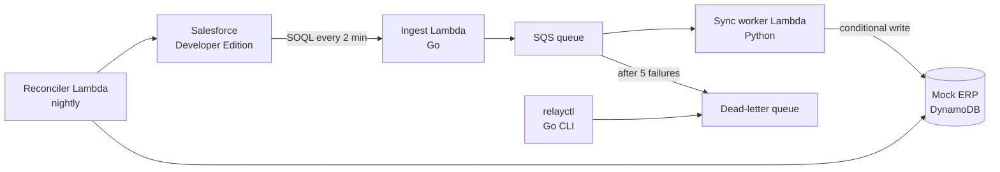
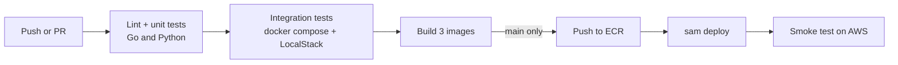

# Relay — CRM to ERP Sync Plan

2026-09-22

Relay mirrors every Closed Won deal in a real Salesforce org into a mock ERP as an order and invoice, exactly once, even when messages repeat, arrive out of order, or the ERP is down. It is fully serverless on AWS so it stays inside the free tier, with Go for ingestion and the ops CLI, Python for the sync logic, Docker for every deployable, and GitHub Actions for CI/CD. No frontend anywhere.

## Architecture

A scheduled Go poller pulls changed deals from Salesforce into SQS; a Python worker turns each message into an ERP order with an idempotent DynamoDB write; failures retry with backoff and end in a dead-letter queue; a nightly job catches anything that slipped through.

Everything is triggered by EventBridge Scheduler or SQS, so nothing runs (or costs) when idle. There is no VPC, no always-on server, and no web UI: you operate it through `relayctl` and the CloudWatch console.

**Why polling instead of push?** Salesforce's real-time Change Data Capture streams over a gRPC API with Avro-encoded events and long-lived connections, which fights Lambda's short-lived model. Polling by `SystemModstamp` is how many production connectors work, it's cheap, and it teaches the watermark problem (section on failure handling). Streaming is a stretch goal.

## Components

Go covers ingestion and operations (about a quarter of the code); Python covers the business logic.

| Component | Language | Runs on | Owns |
| --- | --- | --- | --- |
| Ingest poller | Go | Lambda (container image), EventBridge Scheduler every 2 min | Salesforce OAuth, SOQL query, watermark, publishing to SQS |
| Sync worker | Python | Lambda (container image), triggered by SQS | Validation, field mapping, idempotent ERP write, retry and DLQ decisions |
| Mock ERP | Python | DynamoDB tables `customers`, `orders`, `invoices` + a small library | Data model, conditional writes, version checks |
| Reconciler | Python | Lambda, EventBridge Scheduler nightly | Comparing both sides, reporting drift, re-enqueueing misses |
| relayctl | Go | Your laptop | DLQ inspect and redrive, stats, trigger reconcile, chaos settings |
| Config and secrets | — | SSM Parameter Store | Salesforce client credentials, watermark, chaos flags |
| Infrastructure | YAML | AWS SAM | Every resource above, as code |

**Salesforce side:** a free Developer Edition org, a connected app using the OAuth 2.0 client credentials flow, and a handful of Accounts and Opportunities you create. No Apex code.

**Why Go here:** the poller and the CLI are small, stateless programs that talk to HTTP APIs and AWS. Go gives you a single static binary, fast Lambda cold starts, and an easy CLI. The worker stays in Python because mapping and validation are the part you'll iterate on most.

## Happy path

A deal marked Closed Won shows up in the ERP within about 2 minutes, as one order and one invoice.

1. **Poll.** The ingest Lambda reads the watermark from SSM, then runs a SOQL query for Opportunities with `StageName = 'Closed Won'` and `SystemModstamp >= watermark`, ordered by `SystemModstamp`.
2. **Publish.** For each row it sends one SQS message: the Opportunity fields, its Account, and an **event key** = `OpportunityId:SystemModstamp`. Then it advances the watermark to the newest timestamp it published.
3. **Consume.** SQS invokes the worker Lambda with a batch of up to 10 messages.
4. **Validate and map.** The worker checks required fields and maps Salesforce fields to ERP fields (Account → customer, Amount → order total, CloseDate → order date).
5. **Write.** One DynamoDB transaction upserts the customer, writes the order, and writes the invoice. The order write is conditional: it succeeds only if the order doesn't exist or the incoming version is newer.
6. **Acknowledge.** The worker reports success for that message, and SQS deletes it.

Step 2 uses `>=`, not `>`, on purpose. Two records can share a timestamp, and a strict `>` can skip one forever. Re-reading the boundary means some events are published twice, which is fine because step 5 is idempotent.

## Failure handling

This section is the project. Each row is a failure you trigger on purpose, with a test that proves the system's response.

| Failure | How it happens | What Relay does |
| --- | --- | --- |
| Duplicate message | SQS standard queues deliver at least once; the poller re-reads the watermark boundary | The conditional write sees the same event key and version and does nothing. Duplicates are harmless, not prevented |
| ERP unavailable | Chaos flag makes the ERP layer throw a throttling error at a set rate | Classified as **transient**: the worker sets the message's visibility timeout to `base × 2^attempt + jitter` and reports it failed, so SQS retries later. After 5 receives, SQS moves it to the DLQ |
| Bad data | Opportunity with no Amount or no Account | Classified as **permanent**: retrying cannot fix it. The worker sends it straight to the DLQ with a `reason` attribute and deletes the original |
| Out-of-order updates | A deal is edited twice; SQS delivers the newer edit first | Each order stores its version (`SystemModstamp`). An older version fails the condition and is dropped as stale |
| Worker crashes mid-batch | Lambda timeout or exception after some writes | Partial batch responses report only the failed message IDs; the rest are deleted. Redelivered ones hit idempotency |
| Write succeeded, ack lost | ERP transaction commits, then the Lambda dies before SQS deletes the message | Redelivery hits the conditional write and becomes a no-op. This is why no outbox table is needed here |
| Poller misses a record | Watermark bug, Salesforce outage, clock skew | The nightly reconciler finds Closed Won deals with no matching order and re-enqueues them |
| Deal deleted or reverted in Salesforce | Stage changes back from Closed Won | Out of scope for sync; the reconciler reports it as drift for a human to decide. Say this plainly |

**The core idea to explain in interviews:** you can't get exactly-once *delivery* across two systems, but you can get exactly-once *effect* with at-least-once delivery plus idempotent writes. Every row above is a consequence of that one decision.

**Transient vs permanent** is the second key decision. Retrying a permanent error wastes the retry budget and delays the DLQ alert; dead-lettering a transient error loses work that would have succeeded a minute later.

## AWS cost

Expected cost: well under $1 a month, and close to zero within the always-free limits ([agentdeals.dev, 2026](https://agentdeals.dev/aws-free-tier-2026)). New accounts also get $100–200 in credits.

| Service | Relay's usage | Free allowance |
| --- | --- | --- |
| Lambda | Poller every 2 min ≈ 22K invocations a month, plus worker and reconciler | 1M requests, 400K GB-seconds a month |
| SQS | A few tens of thousands of requests a month (Lambda's polling counts) | 1M requests a month |
| DynamoDB | Three small tables, on-demand or 5 RCU/WCU each | 25 GB, 25 RCU/WCU provisioned |
| CloudWatch | About 6 custom metrics, 3 alarms, 1 dashboard | 10 metrics, 10 alarms |
| ECR (private) | 3 images, a few hundred MB | Not free: about $0.10 per GB-month, so a few cents |
| SSM Parameter Store | Standard parameters | Free |

**Avoid these, which is where student bills come from:**

- **NAT gateway** (about $32 a month). Never put the Lambdas in a VPC; nothing here needs one.
- **RDS, ECS Fargate, EC2 left running.** They bill by the hour whether used or not. That's why the ERP is DynamoDB, not Postgres.
- **Unused public IPv4 addresses** (about $3.60 a month each).
- **Log retention left at "never expire."** Set every log group to 7 days in the SAM template.

**Do on day 1:** create an AWS Budget with an alert at $1, and put the poller schedule behind a flag so you can pause it when you're not working on the project.

## Docker

Docker does two real jobs here: it packages every Lambda, and it runs the whole system locally without an AWS account.

**Images (deployed):** every Lambda ships as a container image pushed to ECR, not a zip.

- `ingest`: multi-stage build. Compile the Go binary in `golang`, copy it into `public.ecr.aws/lambda/provided:al2023`. Final image is tiny.
- `worker` and `reconciler`: the AWS Lambda Python base image matching your local Python version, dependencies pinned in `requirements.txt`.
- These AWS base images include the Lambda Runtime Interface Emulator, so the same image you deploy can be invoked locally over HTTP. That's the "works on my machine" problem, solved properly.

**Local stack (`docker compose up`):**

| Service | Image | Replaces |
| --- | --- | --- |
| `localstack` | `localstack/localstack` | SQS, DynamoDB, SSM |
| `fake-salesforce` | Your own small Python stub | Salesforce's OAuth and query endpoints, returning canned Opportunities |
| `ingest`, `worker` | Your Lambda images | The deployed functions, invoked through the emulator |

The fake Salesforce matters more than it looks. It lets CI run end to end without real credentials, and you can make it return exactly the awkward cases you want to test: duplicate timestamps, missing fields, out-of-order edits.

## CI/CD

Every push is tested against the local stack; every merge to `main` deploys to AWS automatically, with no AWS keys stored in GitHub.

| Stage | Runs | Fails the build if |
| --- | --- | --- |
| Lint | `golangci-lint`, `ruff`, `mypy`, `sam validate` | Any warning |
| Unit | `go test ./...`, `pytest` | Any test fails |
| Integration | `docker compose up`, then the failure-injection suite | Any failure case behaves differently from the table |
| Build | `docker build` for ingest, worker, reconciler | Image fails to build |
| Deploy (main) | Push to ECR, `sam deploy` to the `dev` stack | CloudFormation rolls back |
| Smoke (main) | Put a synthetic message on the real queue, poll DynamoDB for the order within 60 s | Order doesn't appear |

**Authentication:** GitHub Actions OIDC. AWS trusts GitHub's identity token for your repo's `main` branch and hands the workflow a short-lived role. There are no long-lived access keys to leak, which is a good security point to raise in interviews.

**Rollback:** images are tagged with the commit SHA, so redeploying the previous SHA is a rollback. One environment is enough; don't build dev/staging/prod for a portfolio project.

## Testing strategy

The failure-injection suite is the centrepiece: one integration test per row of the failure table, each one triggering the failure and asserting the outcome.

| Layer | What it checks | Tool |
| --- | --- | --- |
| Unit (Python) | Field mapping, validation, transient vs permanent classification, backoff calculation | pytest |
| Unit (Go) | SOQL building, watermark logic including equal timestamps, message encoding | `go test`, table-driven tests |
| Contract | The fake Salesforce returns the same JSON shape as the real API | A recorded real response checked into the repo |
| Integration | Happy path end to end on the local stack | pytest + docker compose |
| Failure injection | Send the same event 3× → one order. Set ERP failure rate to 100% → message reaches the DLQ after 5 tries. Deliver v2 before v1 → v2 survives. Missing Amount → DLQ with a reason, no retries | pytest + chaos flags |
| Reconciliation | Delete an ERP order by hand → next reconcile run restores it | pytest |
| Smoke | One real message through the deployed system | CI after deploy |

Keep the chaos flags in SSM so the same switches work locally and on AWS. `relayctl chaos --erp-fail-rate 0.3` becomes your live demo.

## Observability with CloudWatch

One dashboard and three alarms tell you whether data is flowing, and a DLQ alarm tells you when a human is needed.

**Custom metrics** (namespace `Relay`, emitted with the Embedded Metric Format, so they're just structured log lines; no extra API calls):

| Metric | Emitted by | Tells you |
| --- | --- | --- |
| `EventsPublished` | Ingest | Salesforce changes found per poll |
| `OrdersWritten` | Worker | New or updated orders |
| `DuplicatesSkipped` | Worker | Idempotency doing its job |
| `StaleVersionsDropped` | Worker | Out-of-order deliveries caught |
| `TransientRetries` | Worker | ERP instability |
| `DriftFound` | Reconciler | Records the pipeline missed |

**Alarms:** DLQ depth > 0 (a human must look), `ApproximateAgeOfOldestMessage` on the main queue > 10 minutes (the worker is stuck), and ingest Lambda errors > 0 for 3 runs in a row (Salesforce auth broke).

**Logs:** structured JSON with the event key on every line, so one Logs Insights query traces a single deal from poll to ERP write. Save that query in the README; it's a strong demo.

**Dashboard:** a CloudWatch dashboard defined in the SAM template, so it's version-controlled. Queue depth, DLQ depth, the six metrics, and Lambda duration. No frontend code.

## 2-day build plan

Day 1 builds the whole pipeline locally, with every failure case tested; day 2 puts it on AWS with CI/CD and monitoring. Claude Code does the building; each phase ends with an update explaining what was built and how it works.

| Phase | Work | Done when |
| --- | --- | --- |
| 1.1 Setup | Repo skeleton, docker compose with LocalStack, fake Salesforce stub, DynamoDB table design. You: Salesforce Developer Edition org, connected app, sample data, $1 AWS Budget alert | `docker compose up` runs; a real Salesforce query works from the command line |
| 1.2 Ingest | Go poller: OAuth, SOQL, watermark with `>=`, publish to SQS | Poller publishes correct messages locally, including equal-timestamp cases |
| 1.3 Sync | Python worker: validation, mapping, transactional ERP write with idempotency and version checks | Happy path, duplicate and out-of-order tests pass |
| 1.4 Failures | Transient vs permanent errors, backoff via visibility timeout, DLQ, partial batch responses, chaos flags | Every row of the failure table has a passing test (**minimum credible project**) |
| 2.1 Deploy | Dockerfiles for all Lambdas, SAM template, first deploy to AWS (with your approval) | Real Salesforce → real SQS → real DynamoDB works |
| 2.2 CI/CD | GitHub Actions: lint, tests, LocalStack integration, build, OIDC, deploy, smoke test | A merge to main deploys itself |
| 2.3 Operate | CloudWatch metrics, alarms, dashboard, Logs Insights query; reconciler Lambda; `relayctl` Go CLI | Chaos at 30% shows on the dashboard, the DLQ alarm fires, a deleted order gets repaired (**complete project**) |
| 2.4 Polish | README with architecture diagram, failure table linked to tests, cost notes, 2-minute demo script | Someone else could clone, run and understand it |

The 2 days are building time. Budget extra time afterwards to read the four core pieces (idempotent write, error classification, watermark, reconciliation) until you can explain every line: that's what the interview tests.

## What not to build

| Skip | Why |
| --- | --- |
| Any frontend or admin UI | CloudWatch and `relayctl` cover operations; a UI adds nothing the interview will ask about |
| Kubernetes, ECS, EC2 | Always-on compute costs money and adds nothing for an event-driven workload |
| Postgres / RDS for the ERP | Hourly billing; DynamoDB conditional writes teach idempotency more directly |
| Kafka, Redis, Step Functions | SQS + DLQ already covers the pattern; more pieces only add more names to the README |
| Two-way sync (ERP → Salesforce) | Conflict resolution is a project of its own. Mention it as the next step |
| Salesforce Pub/Sub API streaming | Stretch only, after the core build; it needs a long-lived gRPC connection that doesn't fit Lambda |
| Boomi or MuleSoft | You're showing that you understand what those tools do under the hood, which is more useful to talk about than drag-and-drop screenshots |
| Multiple environments, Terraform + SAM together | One stack, one IaC tool |

## Resume bullet templates

Fill the brackets with numbers you actually measured, and drop any bullet whose feature you didn't build.

- Built an event-driven CRM-to-ERP sync service on AWS (Lambda, SQS, DynamoDB) that mirrors Salesforce Closed Won deals into ERP orders with exactly-once effect under at-least-once delivery.
- Designed idempotent, version-checked DynamoDB writes and transient/permanent error classification with exponential backoff and a dead-letter queue; verified with \[N\] failure-injection tests covering duplicates, out-of-order events, outages and bad data.
- Wrote the Salesforce ingestion poller and an operations CLI (DLQ redrive, reconciliation, chaos controls) in Go.
- Shipped every service as a Docker image with a GitHub Actions pipeline (lint, unit, LocalStack integration tests, ECR push, SAM deploy via OIDC, post-deploy smoke test).
- Added CloudWatch metrics, alarms and a dashboard; a nightly reconciliation job detected and repaired \[N\] injected drift cases, all within the AWS free tier.

## Interview and case-study questions

If you can answer these from your own system, you're ready for both the technical rounds and the case study.

1. Why can't you guarantee exactly-once delivery between Salesforce and the ERP, and what do you guarantee instead?
2. The worker wrote the order, then crashed before deleting the message. What happens next, and why is it safe?
3. How do you decide whether an error should be retried or dead-lettered? Give one example of each.
4. Why `>=` on the watermark? What goes wrong with `>`?
5. Two edits to the same deal arrive in the wrong order. Walk me through what your system does.
6. The ERP was down for two hours. What does the backlog look like, how does it drain, and what alerts fired?
7. Why polling rather than push? When would you switch to streaming?
8. How does your CI/CD deploy without storing AWS keys?
9. **Case study:** finance says 3 orders from last week are missing. How do you find out what happened? (Logs Insights by event key, DLQ, reconciler report.)
10. **Case study:** the business now wants ERP invoice status to flow back into Salesforce. What changes, and what's the hardest part? (Two-way sync, conflict resolution, loop prevention.)
11. Where would a tool like Boomi or MuleSoft replace your code, and what would you still need to design yourself?
12. How would this change at 1,000 deals a second instead of 1,000 a day?
